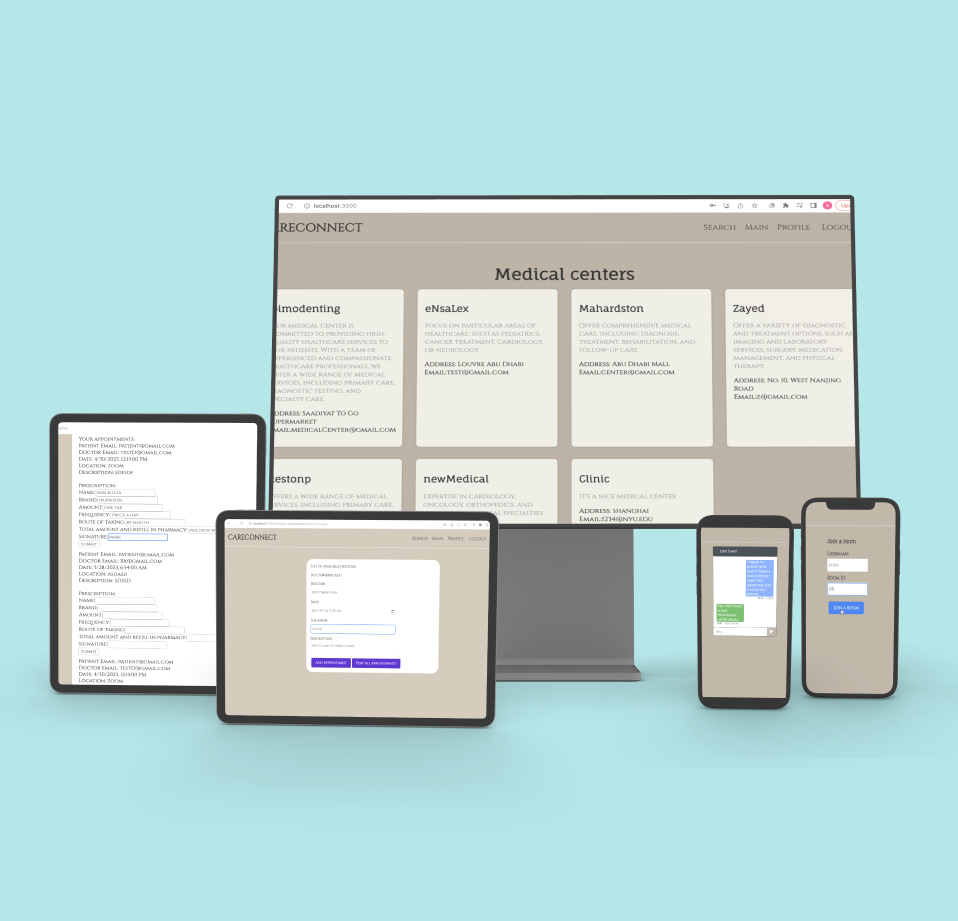

# careConnect
CareConnect is a secure healthcare platform offering searchable medical centers, real-time consultations, and electronic medical records, with features for appointment management and prescription issuing.



## Technology Stack

- **Frontend**: React
- **Backend**: Node.js
- **Database**: MongoDB
- **Containerization**: Docker, Docker Compose
- **Web Server**: Nginx

## Features

- **Searchable Medical Centers**: Patients can quickly locate nearby medical centers, filter by services, ratings and prices.
- **Real-Time Consultations**: Patients can connect with healthcare providers via secure chat.
- **Electronic Medical Records**: Doctors and patients can access and update medical history.
- **Appointment Management**: Healthcare providers can post slots for doctors. Patients can book and reschedule appointments.
- **Prescription Management**: Doctors can issue e-prescriptions and patienets can manage prescriptions electronically.

## Project Structure
The repository is organized as follows:

**Codes/**
Contains the source code for careConnect, including backend and frontend components. This folder is where all primary code development and module implementations can be found.

**Deliverable1/**
contains the project proposal, detailing the initial goals, target audience, and high-level overview of careConnect.

**Deliverable2/**
includes the Software Requirements Specification (SRS), project development work plan, process model, project size estimation, and a technical feasibility study. 

**Deliverable3/**
contains the design documentation, including activity diagrams, sequence diagrams, class diagrams, use case diagrams & scenarios.

**Deliverable4/**
contains the test plan and integration test cases. This deliverable focuses on the validation and reliability of careConnect.

**Deliverable5/**
contains the slide deck for the final project presentation.

Each deliverable corresponds to a major phase in the project’s lifecycle, providing insight into CareConnect’s planning, design, development, testing, and final presentation stages.


## Installation

To set up CareConnect locally using Docker:

### Prerequisites

- Docker
- Docker Compose

### Steps to get started with Docker

1. Clone the repository.
2. Navigate to the repository directory.
2. Build and start the application using Docker Compose:
   ```bash
   docker-compose up --build
   ```
3. Access the application:
- Frontend will be available at http://localhost:3000.
- Backend API will be available at http://localhost:5000.
4. Stop the services:
   ```bash
   docker-compose down
   ```